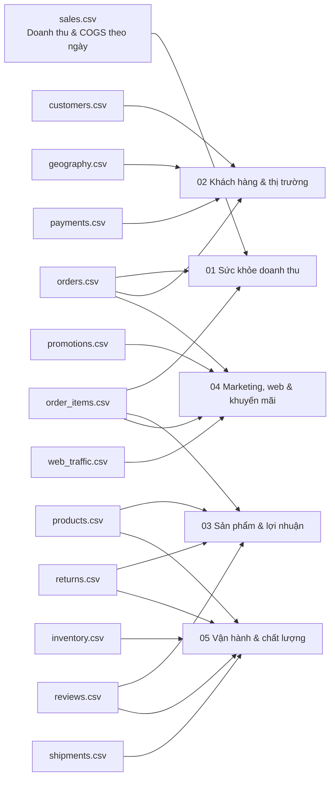

# Tổng quan EDA - Datathon 2026 Vòng 1

## Mục tiêu

Phần 2 yêu cầu khám phá bộ dữ liệu thương mại điện tử thời trang Việt Nam giai đoạn 04/07/2012-31/12/2022 để tìm insight kinh doanh có giá trị. Bộ notebook trong thư mục `EDA` được thiết kế theo hướng kể chuyện bằng dữ liệu, bao phủ bốn cấp độ phân tích:

- **Descriptive:** Điều gì đã xảy ra?
- **Diagnostic:** Vì sao điều đó xảy ra?
- **Predictive:** Tín hiệu nào gợi ý điều sắp xảy ra?
- **Prescriptive:** Doanh nghiệp nên hành động như thế nào?

Tất cả tài liệu, chú thích và kết luận đều dùng tiếng Việt có dấu đầy đủ.

## Bản đồ dữ liệu và domain phân tích



## Cấu trúc notebook

- `01_revenue_health`: sức khỏe doanh thu, COGS, biên lợi nhuận, mùa vụ, bất thường và động lực cấp đơn hàng.
- `02_customer_market`: tăng trưởng khách hàng, hành vi mua lại, cohort, kênh acquisition và khu vực.
- `03_product_profitability`: danh mục, phân khúc, sản phẩm, margin, Pareto, trả hàng và đánh giá.
- `04_marketing_web_promo`: nguồn traffic, chất lượng traffic, mức độ dùng khuyến mãi và uplift trong campaign.
- `05_operations_quality`: vận chuyển, trả hàng, review, tồn kho, stockout, overstock và fill rate.

## Cách chạy lại

Chạy từ thư mục gốc dự án:

```powershell
conda activate base
python EDA/build_notebooks.py
jupyter nbconvert --to notebook --execute --inplace EDA/01_revenue_health/01_revenue_health.ipynb
jupyter nbconvert --to notebook --execute --inplace EDA/02_customer_market/02_customer_market.ipynb
jupyter nbconvert --to notebook --execute --inplace EDA/03_product_profitability/03_product_profitability.ipynb
jupyter nbconvert --to notebook --execute --inplace EDA/04_marketing_web_promo/04_marketing_web_promo.ipynb
jupyter nbconvert --to notebook --execute --inplace EDA/05_operations_quality/05_operations_quality.ipynb
```

Các biểu đồ chính được lưu vào `EDA/figures` để có thể đưa vào báo cáo.

